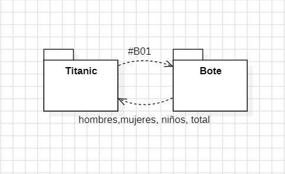
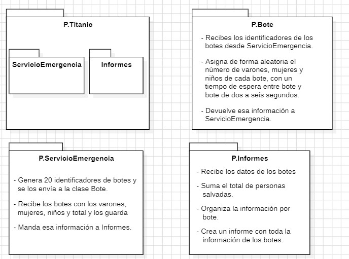
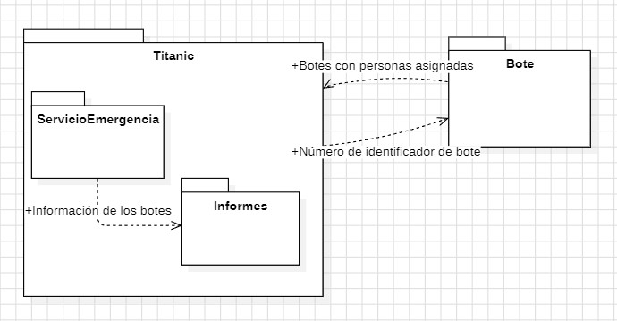

# TITANIC
INTEGRANTES QUE COMPONEN EL GRUPO:
- CLAUDIA CARRETERO GARCÍA
- ALEJANDRO GÓMEZ DE JUAN


## ÍNDICE


---


## ANÁLISIS
EN ESTA PRÁCTICA TENEMOS QUE TRABAJAR CON LA GESTIÓN DE LOS BOTES SALVAVIDAS DEL TITANIC. CADA BOTE PODRÁ LLEVAR ENTRE 1 Y 100 PERSONAS, Y ESA CANTIDAD SE ASIGNARÁ DE FORMA ALEATORIA CADA CIERTO TIEMPO, ENTRE 2 Y 6 SEGUNDOS. CUANDO YA SE SEPA CUÁNTAS PERSONAS HAY EN CADA BOTE, SE DEBERÁ INFORMAR AL SERVICIO DE EMERGENCIAS. ESTE SERVICIO SERÁ EL ENCARGADO DE GENERAR UN INFORME CON LA INFORMACIÓN DE CADA BOTE: LA FECHA DEL INFORME, EL NÚMERO DEL BOTE, EL TOTAL DE PERSONAS A BORDO (PERSONAS SALVADAS) Y LA CANTIDAD DE MUJERES, HOMBRES Y NIÑOS.


---


## DISEÑO DE LA SOLUCIÓN


### ARQUITECTURA



### COMPONENTES



### PROTOCOLO DE COMUNICACIÓN



---


## PLAN DE PRUEBAS


### PRUEBAS BOTES


- COMPROBAREMOS QUE EL NÚMERO TOTAL DE PERSONAS SALVADAS POR CADA BOTE ESTÉ DENTRO DEL RANGO ENTRE 1 Y 100.
- REVISAREMOS QUE EL FORMATO DEL RESULTADO SEA EL CORRECTO, CON EL IDENTIFICADOR DEL BOTE SEGUIDO DE LOS NÚMEROS DE MUJERES, HOMBRES Y NIÑOS.
- TAMBIÉN NOS ASEGURAREMOS DE QUE EL IDENTIFICADOR DEL BOTE SE MANTENGA EN LA SALIDA, PARA PODER SABER DE QUÉ BOTE VIENEN LOS DATOS.


### PRUEBAS SERVICIO EMERGENCIA


- VERIFICAREMOS QUE SE GENEREN LOS 20 IDENTIFICADORES DE BOTE, CON EL FORMATO ESPERADO (DE B00 A B19).
- TAMBIÉN HAREMOS UNA PRUEBA PARA VER QUE, AUNQUE NO HAYA DATOS, EL SISTEMA NO FALLE Y EL INFORME SE CREE IGUALMENTE.


### PRUEBAS GENERALES


- POR ÚLTIMO, REALIZAREMOS UNA PRUEBA QUE SIMULE TODO EL PROCESO COMPLETO: SE CREARÁN LOS BOTES, SE GENERARÁN LOS DATOS, SE RECOGERÁN Y SE ELABORARÁ EL INFORME. ASÍ NOS ASEGURAREMOS DE QUE TODO EL SISTEMA FUNCIONE DE PRINCIPIO A FIN SIN ERRORES.


---


## ELEMENTOS DESTACABLES DEL DESARROLLO
### BOTE.JAVA Y IBOTE.JAVA
**`SIMULACIÓN CON ALEATORIEDAD CONTROLADA:`**
- EL MÉTODO contarPasajeros() UTILIZA Random PARA GENERAR UN NÚMERO TOTAL DE PASAJEROS Y DISTRIBUIRLOS ENTRE MUJERES, VARONES Y NIÑOS DE FORMA COHERENTE:


```java
    int total = random.nextInt(100) + 1;
    mujeres = random.nextInt(total + 1);
    varones = random.nextInt(total - mujeres + 1);
    niños = total - mujeres - varones;
```


**`SALIDA ESTRUCTURADA PARA COMUNICACIÓN ENTRE PROCESOS:`**
- EL MÉTODO obtenerResultado() DEVUELVE LOS DATOS EN FORMATO CSV:


```java
return String.format("%s,%d,%d,%d", id, mujeres, varones, niños);
```


**`INTERFAZ IBOTE COMO CONTRATO FUNCIONAL:`**
- DEFINE LOS MÉTODOS ESENCIALES PARA CUALQUIER CLASE QUE REPRESENTE UN BOTE:


```java
void contarPasajeros();
String obtenerResultado();
```
---


### SERVICIOEMERGENCIA.JAVA Y ISERVICIOEMERGENCIA.JAVA
**`GENERACIÓN DE IDENTIFICADORES ÚNICOS:`**
- EL MÉTODO generarIds() CREA 20 IDS CON FORMATO B00, B01, ..., B19:


```java
String.format(FORMATO_ID_BOTE, i);
```


**`EJECUCIÓN DE PROCESOS EXTERNOS CON LECTURA ROBUSTA:`**
- EL MÉTODO enviarId() LANZA CADA BOTE COMO PROCESO INDEPENDIENTE Y LEE SU SALIDA LÍNEA POR LÍNEA:


```java
BufferedReader reader = new BufferedReader(new InputStreamReader(process.getInputStream()));
String line;
while ((line = reader.readLine()) != null) {
    String[] partes = line.split(COMA);
    recibirBotesAsignados(partes[0], ...);
}
```


**`ALMACENAMIENTO EFICIENTE DE DATOS:`**
- LOS DATOS DE CADA BOTE SE GUARDAN EN UN Map<String, int[]>, DONDE LA CLAVE ES EL ID DEL BOTE Y EL VALOR ES UN ARRAY CON LOS TRES GRUPOS DE PASAJEROS:


```java
datosBotes.put(id, new int[]{mujeres, varones, niños});
```


**`INTERFAZ ISERVICIOEMERGENCIA COMO GUÍA DE IMPLEMENTACIÓN:`**
- DEFINE LOS MÉTODOS CLAVE DEL SERVICIO:


```java
List<String> generarIds();
void enviarId();
void recibirBotesAsignados(...);
void generarInforme();
```
---


### INFORMES.JAVA Y IINFORMES.JAVA
**`FORMATO MARKDOWN PROFESIONAL:`**
- EL INFORME SE GENERA CON ENCABEZADOS, BLOQUES DE DATOS Y TOTALES, USANDO String.format() Y BLOQUES MULTILÍNEA:


```java
private static final String BLOQUE_DATOS = """
    ## %s


    - Total Salvados %d
      - Mujeres %d
      - Varones %d
      - Niños %d


    """;
```


**`USO DE DateTimeFormatter PARA NOMBRES DE ARCHIVO Y ENCABEZADOS:`**
- SE EMPLEAN DOS FORMATOS DISTINTOS PARA FECHA:
  - PARA EL NOMBRE DEL ARCHIVO:
```java
"yyyyMMdd_HHmmss"
```


- PARA EL ENCABEZADO DEL INFORME:


```java
"dd/MM/yyyy 'a las' HH:mm:ss"
```


**`INTERFAZ IINFORMES COMO PUNTO DE EXTENSIÓN:`**
- DEFINE EL MÉTODO generar(...) QUE PERMITE IMPLEMENTAR DISTINTOS TIPOS DE INFORMES EN EL FUTURO:


```java
void generar(Map<String, int[]> datosBotes, LocalDateTime fecha);
```
---


## PROBLEMAS ENCONTRADOS


**`ERROR EN LA DISTRIBUCIÓN DE PASAJEROS EN BOTE.JAVA:`** EN UNA VERSIÓN INICIAL, LA SUMA DE MUJERES, VARONES Y NIÑOS PODÍA SUPERAR EL TOTAL DE PASAJEROS GENERADO. ESTO OCURRÍA PORQUE SE USABAN TRES LLAMADAS INDEPENDIENTES A Random. LA SOLUCIÓN FUE CALCULAR EL TOTAL PRIMERO Y LUEGO DISTRIBUIRLO DE FORMA CONTROLADA:


```java
int total = random.nextInt(100) + 1;
mujeres = random.nextInt(total + 1);
varones = random.nextInt(total - mujeres + 1);
niños = total - mujeres - varones;


```


**`NOMBRE INCORRECTO DE LA CLASE EN SERVICIOEMERGENCIA.JAVA:`** LA CONSTANTE CLASE_BOTE TENÍA UN PAQUETE MAL ESCRITO, LO QUE IMPEDÍA EJECUTAR LOS PROCESOS DE LOS BOTES. SE CORRIGIÓ ASÍ:


```java
private static final String CLASE_BOTE = "ies.tierno.Bote.Bote";
```


**`FALTA DE FORMATO EN LA SALIDA DE LOS BOTES:`** EN LAS PRIMERAS PRUEBAS, LA SALIDA DE CADA BOTE NO SE PODÍA LEER CORRECTAMENTE PORQUE NO SE USABA UN FORMATO FIJO. SE RESOLVIÓ USANDO String.format() PARA DEVOLVER LOS DATOS EN FORMATO CSV:


```java
return String.format("%s,%d,%d,%d", id, mujeres, varones, niños);
```


**`LECTURA INCOMPLETA DE LA SALIDA DEL PROCESO:`** SE USABA SOLO readLine() SIN BUCLE, LO QUE LIMITABA LA CAPTURA A UNA ÚNICA LÍNEA. SE MEJORÓ USANDO:


```java
while ((line = reader.readLine()) != null) {
    String[] partes = line.split(COMA);
    recibirBotesAsignados(partes[0], ...);
}
```


**`NOMBRE DEL ARCHIVO DE INFORME SIN FECHA:`** EN UNA VERSIÓN INICIAL, EL INFORME SE LLAMABA SIEMPRE informe.md, LO QUE PROVOCABA QUE SE SOBRESCRIBIERA EN CADA EJECUCIÓN. SE IMPLEMENTÓ UN FORMATO DE FECHA Y HORA PARA GENERAR NOMBRES ÚNICOS:


```java
DateTimeFormatter formatter = DateTimeFormatter.ofPattern("yyyyMMdd_HHmmss");
String nombreArchivo = "Informe_" + fecha.format(formatter) + ".md";
```

ola